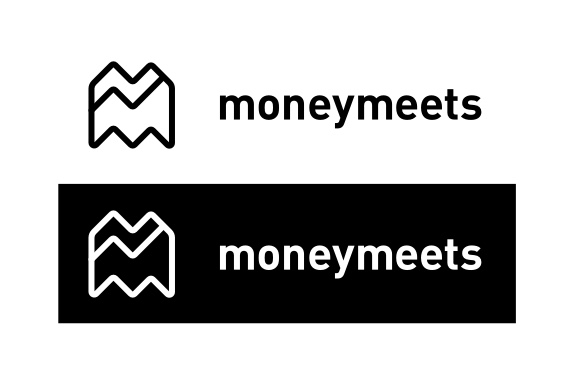
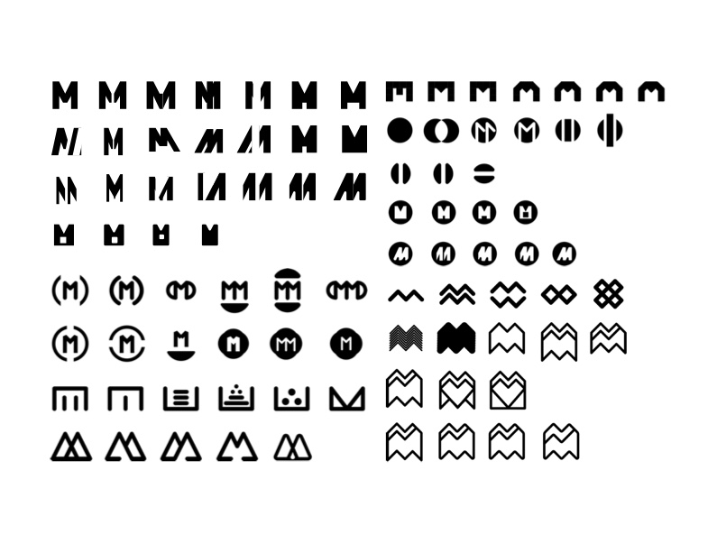
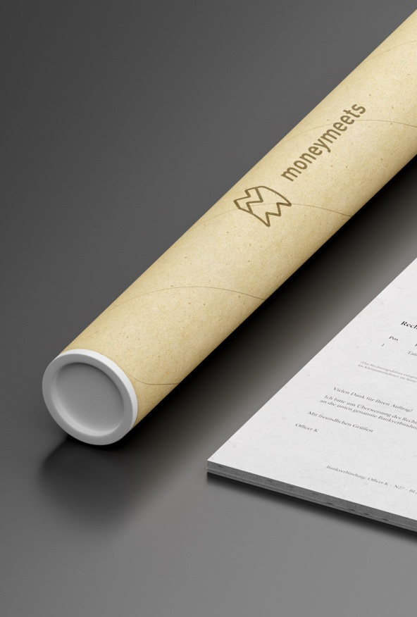
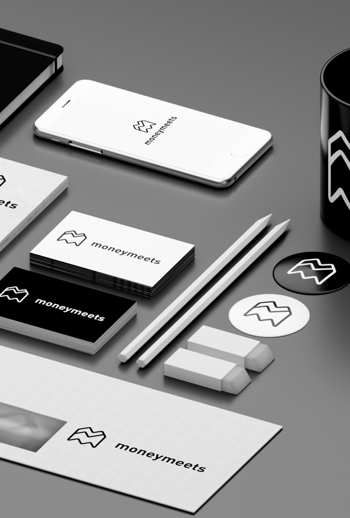
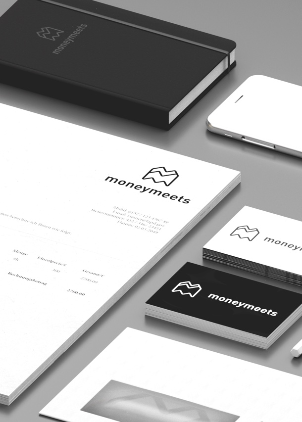

What if? The old Corporate Identity (CI) of a German Fintech startup was created in 2011, but the Business focus shifted since then. In times where a brand has to be presented on all plattforms and screensizes, the CI has to be adaptive, from classic print to adaptive screensizes.

This Corporate Identity was built from scratch and presented on different mediums. For this, I created a studio mockup and tried different lighting setups to present the CI on different materials. This project was made with 3D-rendering.

