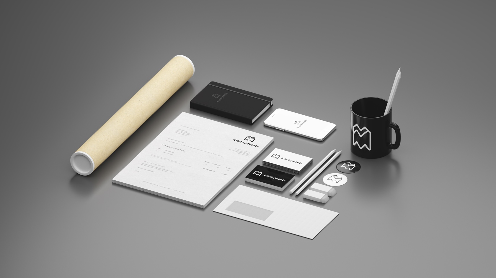

So, you quit your job. You’re on your own now.
Congratulations!
Now you have to find new clients — build those relationships— learn sales — learn accounting — get in to the hustle. There are tons of articles out there about the logistics and skills of freelancing. But there aren’t too many about attitude.
And so, I present to you my _wildly idealistic, but that hasn’t stopped working for me yet_ principles for success.

