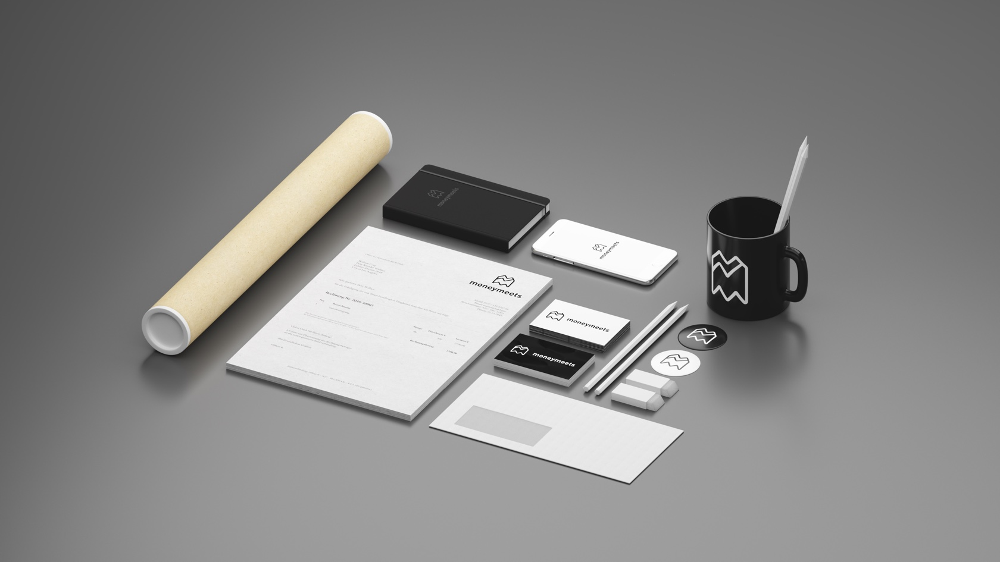

_What if?_
The old Corporate Identity from a german Fintech startup has its origin in the year 2011, but the Business focus shifted a lot since. In times where a brand has to be presented on all plattforms and screensizes the CI has to be adaptive from the start. From classic Print to adaptive screensizes the Corporate Identity was build from scratch and presented on different mediums.

_Was wäre wenn?_  
Die mittlerweile veraltete Corporate Identity von moneymeets stammt noch aus der Gründerzeit 2011, doch die Geschäftsstrategtie hat sich seitdem fundamental geändert. In Zeiten wo Unternehmen auf allen Medien und Platformen vertreten sein wollen, muss die Marke und das CI flexibel und einfach zu verstehen sein.
Von Geschäftspapieren bis zu Smartphones sollte die Erscheinung der Marke funktionieren.
Anschließend habe wurde das neue Logo auf verschiedenen Trägermedien in 3D gerendert.

