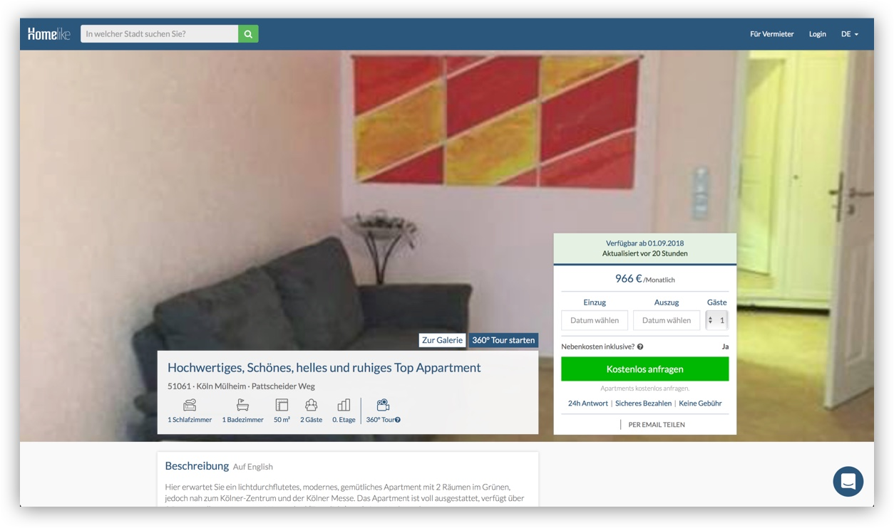
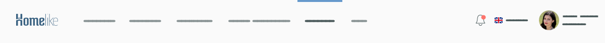
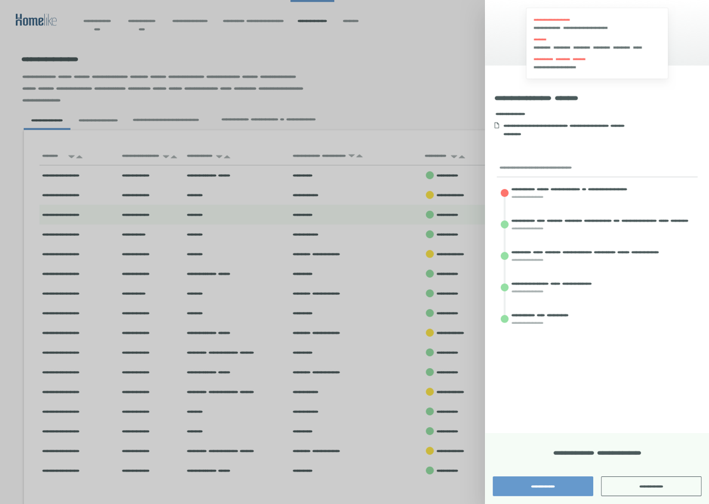
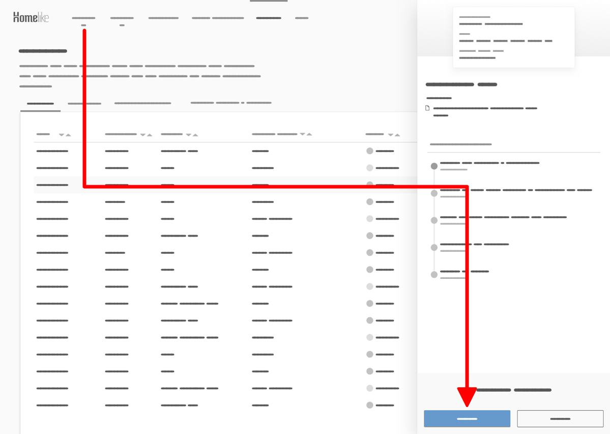
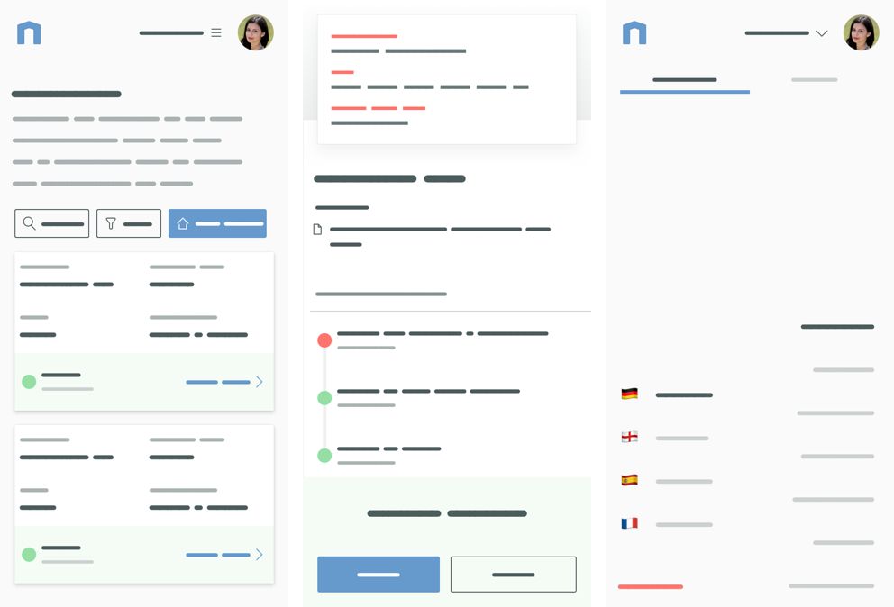
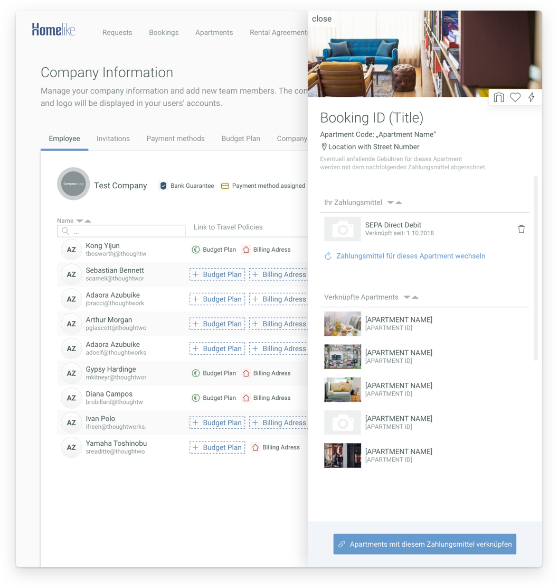

This was a tough Project. The Homelike application is a very powerful and feature-rich tool, which gives the User the possibility to manage his requests, bookings and other apartment related topics. The concept is for all contents to be reachable within a few clicks and fully functional on mobile screens. In order to support the User with his tasks, everything is designed to follow a guiding navigation structure.

### Dashboard – Before

In the old version there were several issues with the overview in the tables. If the users wanted to see more details in one booking, the table cell opened itself vertically, pushing all other entries outside the view. Furthermore, the horizontal alignment of the details made a mobile version of the Dashboard nearlly impossible to use. So a completly new design was conceptualized from scratch, with mobile experience and UX guidelines in mind.

I started with the global navigation as a Sidebar. While the classical layout, with the header on top, navigation on the left and content right offers easy and fast understanding of the application, the space for the content gets limited by the fixed width of the Sidebar, especially on smaller desktops. And because we use a lot of tables with more than 5 columns, we need as much space as possible horizontally. That is why I placed the navigation on top of the page and made it scale horizontally. It is the first thing the user perceives when reading from top to bottom, so we support the hierachy of the page content by using a top-placed navigation.

Now let's talk about the tables, they are for the most part the main content of the application. I emphasize them, by placing them on a white panel, while the rest of the dashboard gets a light gray background to communicate the visual hierachy of the User Interface. 
Between the main navigation and white table panel there is a headline with a description to tell the user where they are on the current page. In addition to that, there is a small tab navigation, which serves as the second hierachy level for the content over the white background. 
I limited myself to as few colors as necessary, because I wanted to guide the user to the main action of the current view, the Call-To-Action. There is always one very prominent button which in most cases is the most important task. You can see it here on the top right corner of the table.

A little more about the tables. 
But how do we solve the problem with the vertically expanding table cells, which push the content below out of the screen? How can I build a table on a mobile screen, where the width is limited and only vertical scrolling feels comfortable? 
Let’s beginn with the desktop table. The table consists of fully clickable rows, which will be reveal the details about this data entry. The new addition is a sidebar, which comes in from the side, which overlaps the content instead of pushing it away.

The sidebar is the exact same component we use on a mobile screen. It has a fixed width and the content is vertically scrollable, which fits nicely in the desktop view and is perfect for scrolling on smartphones. 
Same size on desktop and mobile, same codebase, same experience.

When opening the sidebar the previous primary Call-To-Action is hidden behind the sidebar, it is no longer the main task of the page, instead the sidebar is now in focus for the user and it has its own Call-To-Action on the bottom. This top-left to bottom-right pattern is the guide we use on all pages to support the user throughout the dashboard.

The last pattern we have to have a look at is mobile view for the table. On the desktop screens we have a lot of horizontal space, mobile screens are better for vertical spacing. I took the information we show inside one table row and reordered them in card style.

