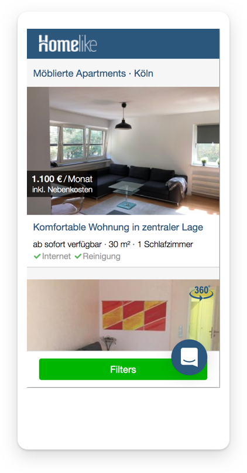

On the second of January 2018 I joined [Homelike](https://thehomelike.com/) as a Visual / Interface Designer. Homelike is a startup specializing in renting high quality serviced apartments for business travellers. One of the most important goals was to create an easy, clear, but still powerful UI for corporate users and landlords, which often still use pen and paper methods for documenting apartment availabilities. 
The Redesign included the Apartment Search Page, the [Apartment View Page](/portfolio/homelike-view) and the complete [Dashboard](/portfolio/homelike-dashboard). 
I will be talking about the problems I faced when reviewing the old design and show my solutions.

### Overview

The apartment photos are the most important tool to communicate Homelike's high quality apartment standards. They should be warm, comfy and welcoming to new customers. But the old design had a lot of visual noise which distracted from otherwise good photos, so my main focus was to build a UI which gave the photos enough room to shine and appeal to the Users. 
Things like the prominent blue topbar or the usage of lots of borders and different background shades contribute to the distractions. My goal was to design a page, which emphasizes the photos as much as possible, without losing funtionality.

### Apartment Cards

Starting with the Apartment Cards and the integrated photos themselves, I tried to remove as many elements from the photo as possible and reorder them into the bottom of the apartment card. This allows the photo to be fully visible, without loosing focus on the price, which is now more prominent and in Homelike's main color. 
The cards contain more information, without looking bloated, which is important when repeated many times in a grid.

### Map Design

Another important eyecatcher was the map on the right side. Its appereance was outdated, with colors not defined in the Corporate Identity and hard-to-read labels. When the user spotted an interesting apartment in the grid, there was no way of telling where the corresponding location is on the map. 
This lack of Interaction was solved by making all price tags white, and only the actively hovered apartment gets a contrast-rich blue background. Other Points of interests like transportation labels and parks are in desatureted colors, so that they don't disctract from the photos.

### Mobile Screens

Homelike's search-page was originally built on a rather simple Bootstrap grid. The main focus of the old design was to perform on desktop screens, which led to the mobile experience suffered with pixelated, oversized photos and hard to tap Call-to-Actions.
 
I approached my redesign with the mobile-first attitude. Everything has to work on mobile and all features are therefore included in every screensize. No more feature-reduced mobile experiences, all desktop features can be used on the go. 
New features, like the integrated gallery on the apartment card, feel native on mobile browsers with swipe gestures.

### Flexible Breakpoints

With our mobile-first approach, we definded a lot of screensizes which can be combined to create a new way to navigate the page. For example, when the you click on an apartment, a new tab opens and shows the Apartment View Page. 
We tried to iterate on this idea, by allowing the user to see the apartment on the same page in a sidebar, which utilizes the mobile layout of the apartment view page. We could therefore boost our conversion futher, by just combining existing components and views in a clever way.

### Searchpage - Conclusion

When combining everything together, the user is greeted with a cleaner, modern looking search-page which focusses on quality photos. The main layout keeps its roots in order to not confuse long-term users. It doesn’t matter, if the user is on his smartphone or desktop, the search experience stays the same. After the release, our customers were positivly surprised and raised their conversion rates by a significant margin.

