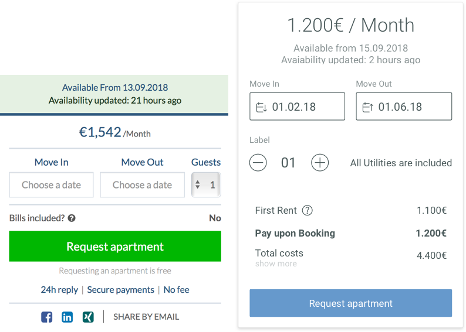
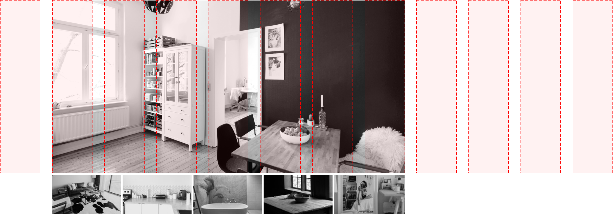
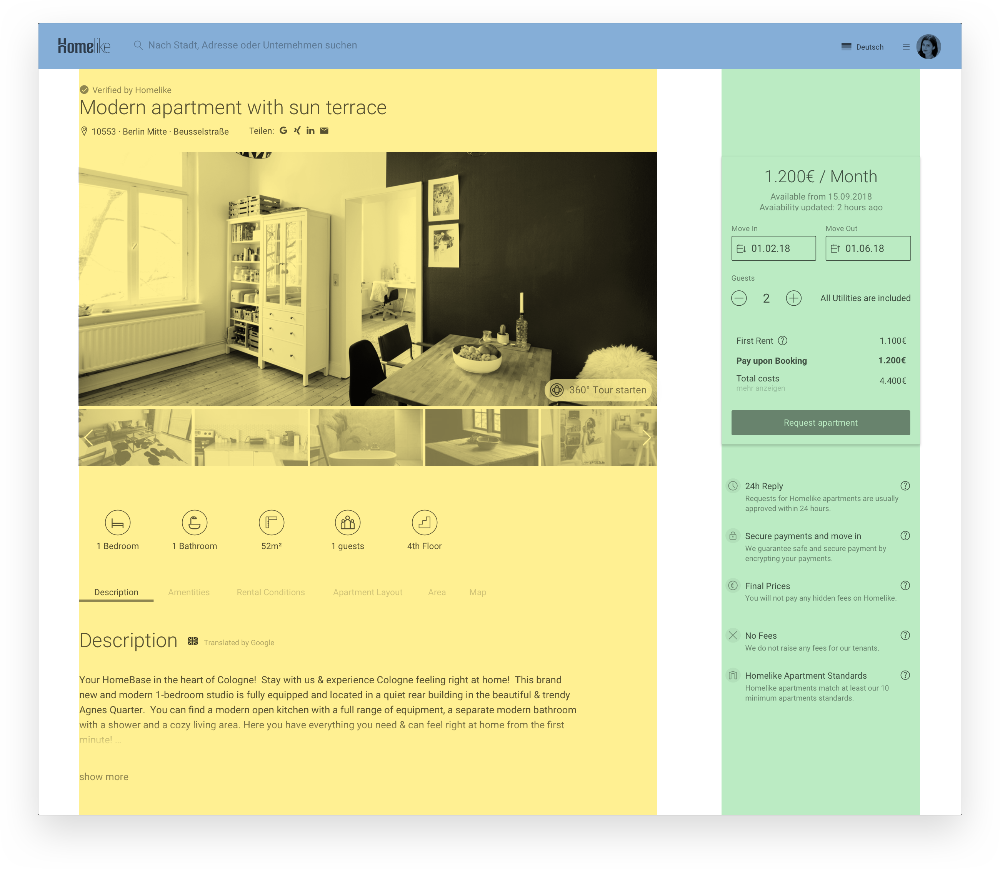
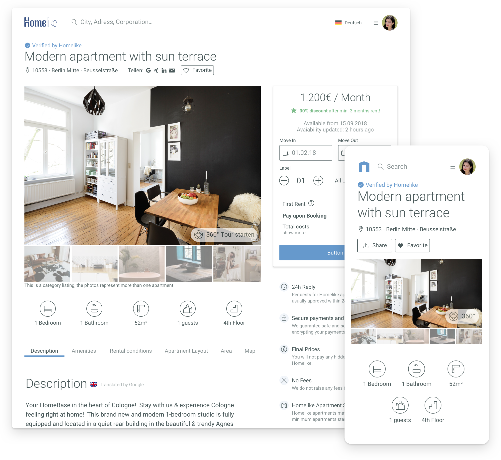

The Apartment View Page contains all relevant information about the apartment and tries to convince the user to book it. It should be easy to quickly scan the apartment. We emphasize the most important informations and keep secondary informations in the background. 
Like on the [search-page](/portfolio/homelike-search), the photos are a good way to communicate the Homelike Quality Standards, which every apartment must meet.

### Overview

The old design suffered from the way its main photo was displayed. Depending on the screen-size, the photos in the header were stretched up to a 1920px width, which distorts the quality of the images and showed compression artifacts. 
Furthermore, the primary action of this page is to book the apartment. The old design did not support this business decision, because the old Call-to-Action button conflicts with other dominant UI-Elements, such as the Topbar. Shifting focus to the quality photos and the "Book Now" CTA was the goal of the redesign.

### The Pricing Box

The previous decision to let the pricing box be sticky and scroll with the content was a good idea, so I kept it this way. But the layout of the whole page had to support this behavior by having enough space to the right side in order for the box to not interfere with underlying content. This plays well with the new idea to limit the picture-width, which will be discussed later in this article.

In contrast to the old pricing box, the monthly rent is shown first and in bigger typo. The availability (which has a prominent background in the old version) is treated like secondary information, with a smaller font size and under the Monthly Rent.

In order for the focus to be on the CTA, UI-Elements like the share-function and trust elements were moved into other parts of the page.

### Apartment Pictures

The Quality pictures of the apartment might be enough to convince the user to book his stay there, which is why we needed to avoid pixelated or badly cropped images. Therefore I created a 12-column Grid for the whole page, in which the gallery has a fixed position in its width. This guarantees, that the picture cannot be stretched above its native resolution and that even portrait shots from smartphones are displayed in its native aspect ratio (which we do not endorse).

Another problem with the old way of showing apartments was the fact, that only the first picture was shown. There was no obvious way of knowing, that there were more pictures wating to be discovered. The gallery was hidden behind a secondary Call-to-Action, which according to some tests we conducted was ignored. 
Most of the users clicked intuitively on the big picture in the header itself to open the gallery, so I adopted this behaivor on the main picture in the gallery. In addition to that, I added a small thumbnail gallery beneath the main photo to show the other pictures.

### The Grid

Using a combination of a classical 12-column layout and a Soft Grid, which describes the margins between different components, enables us to combine components in their different breakpoint states. For example, the pricing box on the right side is nothing else than the mobile view, placed on the green gridlane, to reserve space when the pricing box scrolls. The yellow grid is the tablet view on desktop, without the sticky pricing box on the bottom, which appears only on mobile and tablet.

### Apartment View Page - Conclusion

The new design for the Apartment View Page emphasizes the most important elements and functions for the User in order to convince him to book the apartment. It's easy to spot the primary Call-To-Action "Book now" and all apartment photos are in a high quality with an optimal resolution and aspect ratio. We show additional photos in a thumbnail gallery and everything is presented on mobile screens without cutting features out.

