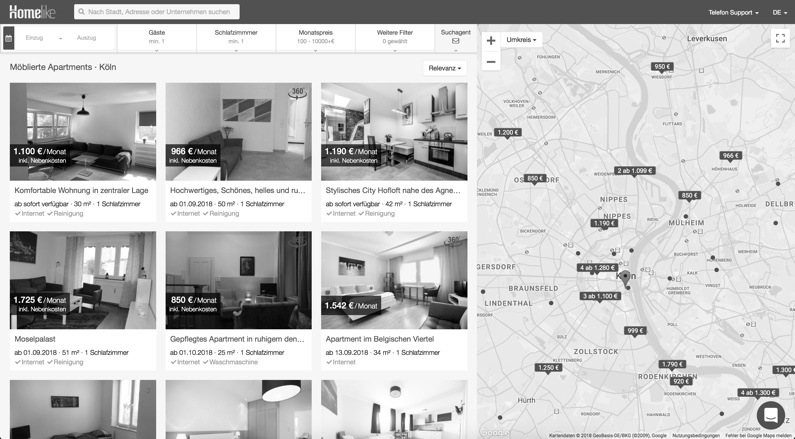
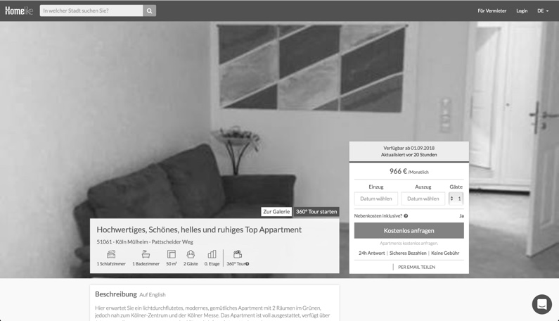
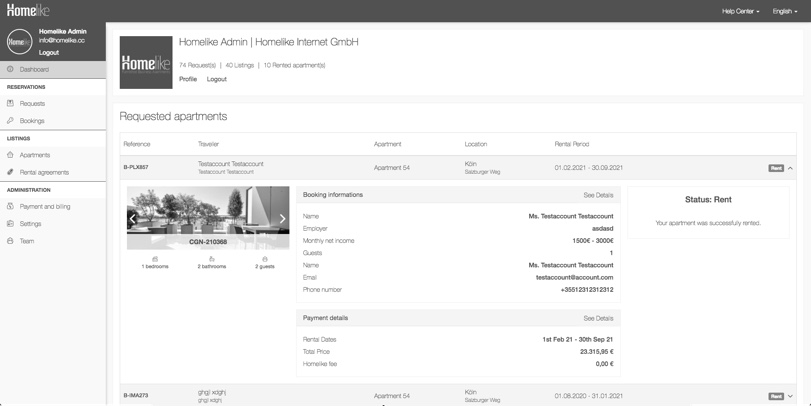
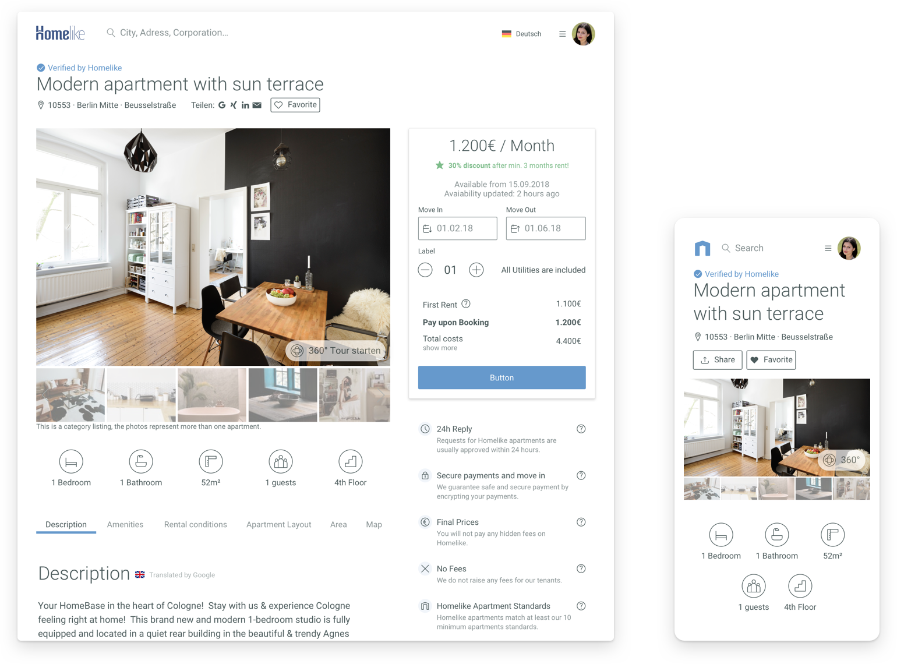
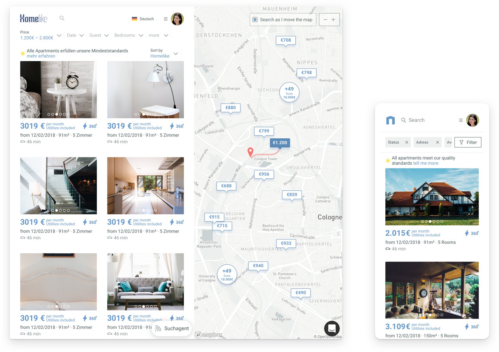
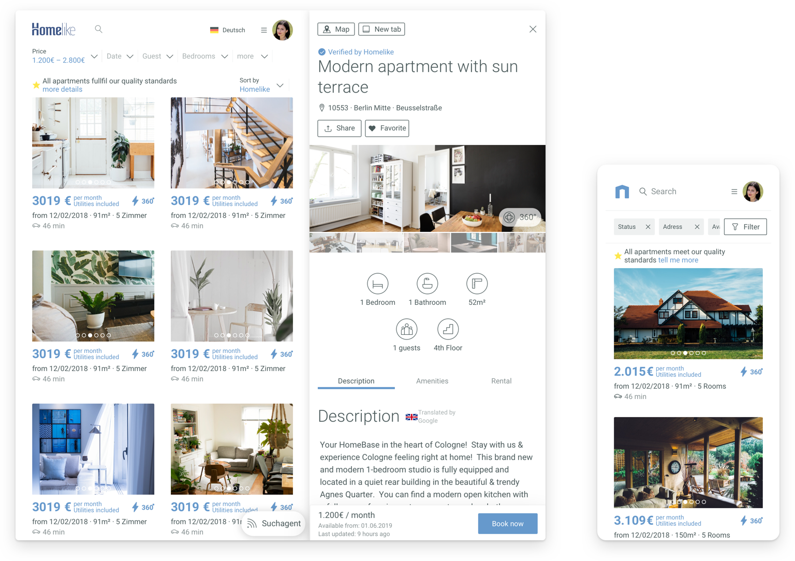
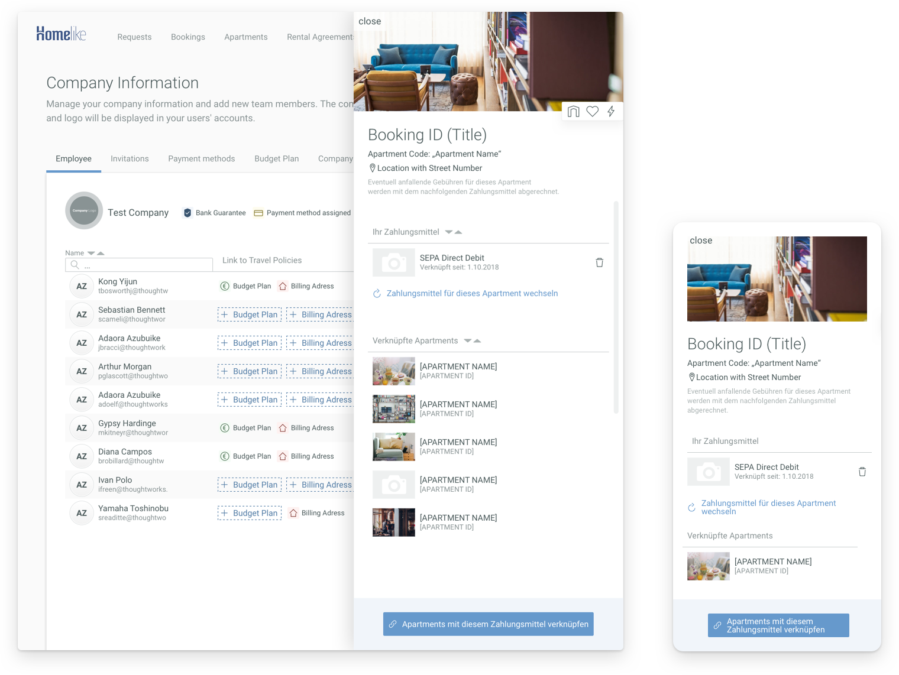

In the second of january 2018 I joined thehomelike.com as a Visual / Interface Designer. Homelike is a startup specializing in renting high quality apartments for business travellers. One of the most important goals was to create a easy, clear but still powerful UI for mainly corporate users and landlords, which still use pen and paper methods for documenting apartments availabilities. First I would like to show the old Interface, which was at that time a fast and good solution, but with a growing userbase and the increase of mobile usage a new visual direction was needed.

There is alot of visual noise which distracts from the good looking photos from the apartments. Thinks like the prominent blue topbar or the usage of lots of borders and different background-shades contribute to the distraction. My goal here will be to design a page, which emphasise the photos as much as possible, without losing funtionality.

The Apartment View Page suffers from the opposite problem, it offers too much space for the photos. Depending on the screensize, the photos in the header can be stretched up to 1920px width, which distorts the quality of the image and shows compression artifacts. Furthermore, the primary action of this page is to book the apartment. The design doesn’t support this business decision, because the old Call-to-Action button conflicts with dominant colorsfrom other UI-Elements such as the Topbar. Shifting focus on the quality photos and the „Book Now“ will be the goal of the redesign.

The last project is the improvement of the app itself, the dashboard. The users spend their time in the app to manage their current bookings, payment related topics and rental agreements. In the old version there were several issues with the overview in the tables. If the users wanted to see more details in one booking, the tablecell opened itself vertically, pushing all other entries outside of the screenview. Furthermore, the horizontal alignment of the details made a mobile version of the Dashboard nearlly impossible. So a completly new design was made from scratch with mobile experience in mind.

**The new Viepage.**   The Apartment Photos and the primary Call-to-Action get the most attention, everything else is minimalistic and tries to use as few colors as possible.

**The new Searchpage.**  
Photos play a dominant role in these screens. Because we designed the screens with a mobile-first attitude in mind, we can combine different screensizes in one page (Search Page on the left, Apartment View on the right).

**The new Dashboard.**  
Instead of using a vertical accordion-style detailsview for the tableentries, all tablecells open a sidebar on the right, which contains all details and Call-To-Actions. The Sidebar uses the same layout as the mobile screen, which makes it only one component to maintain.
