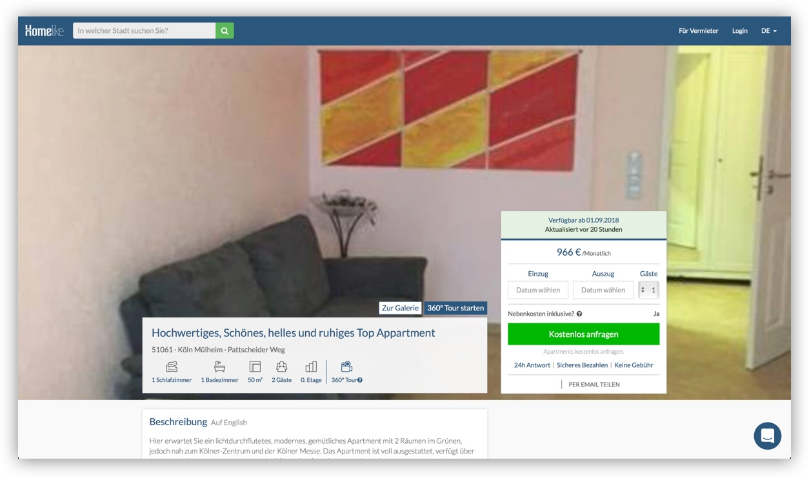
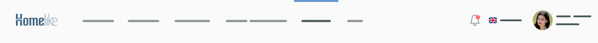
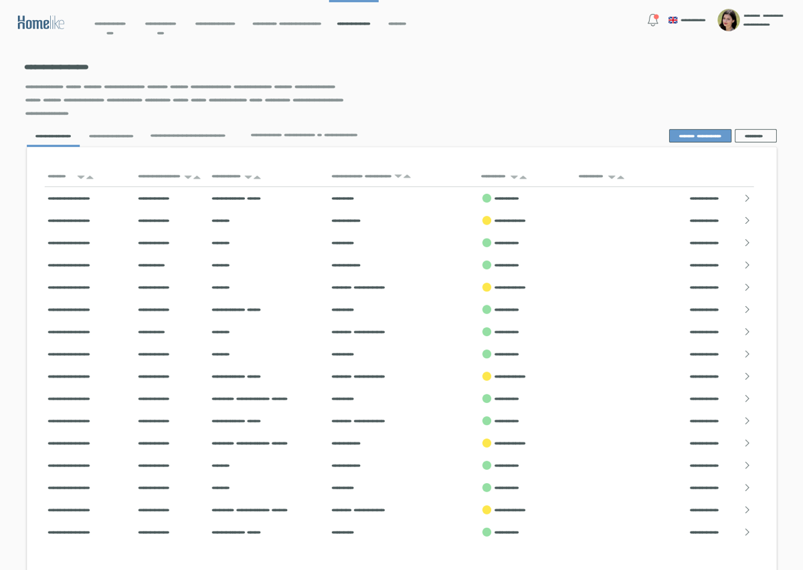
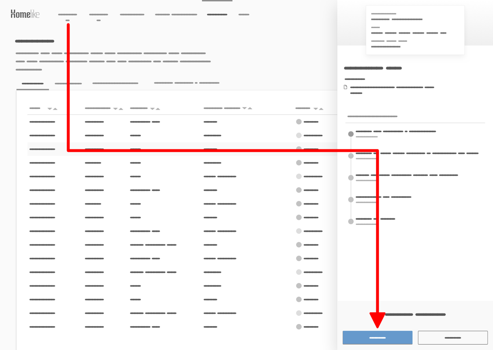
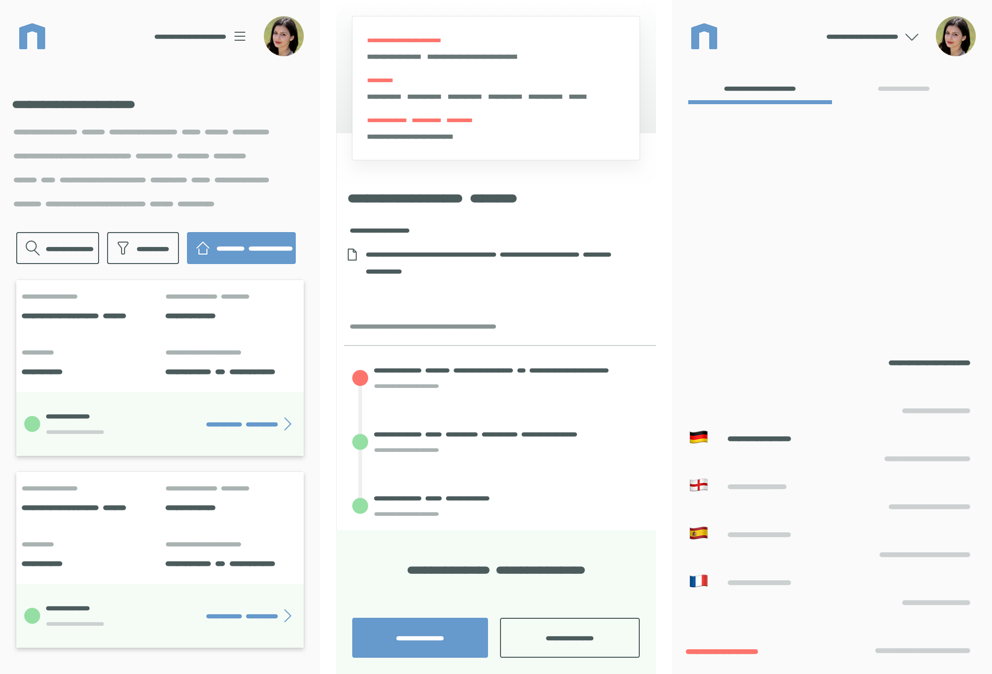
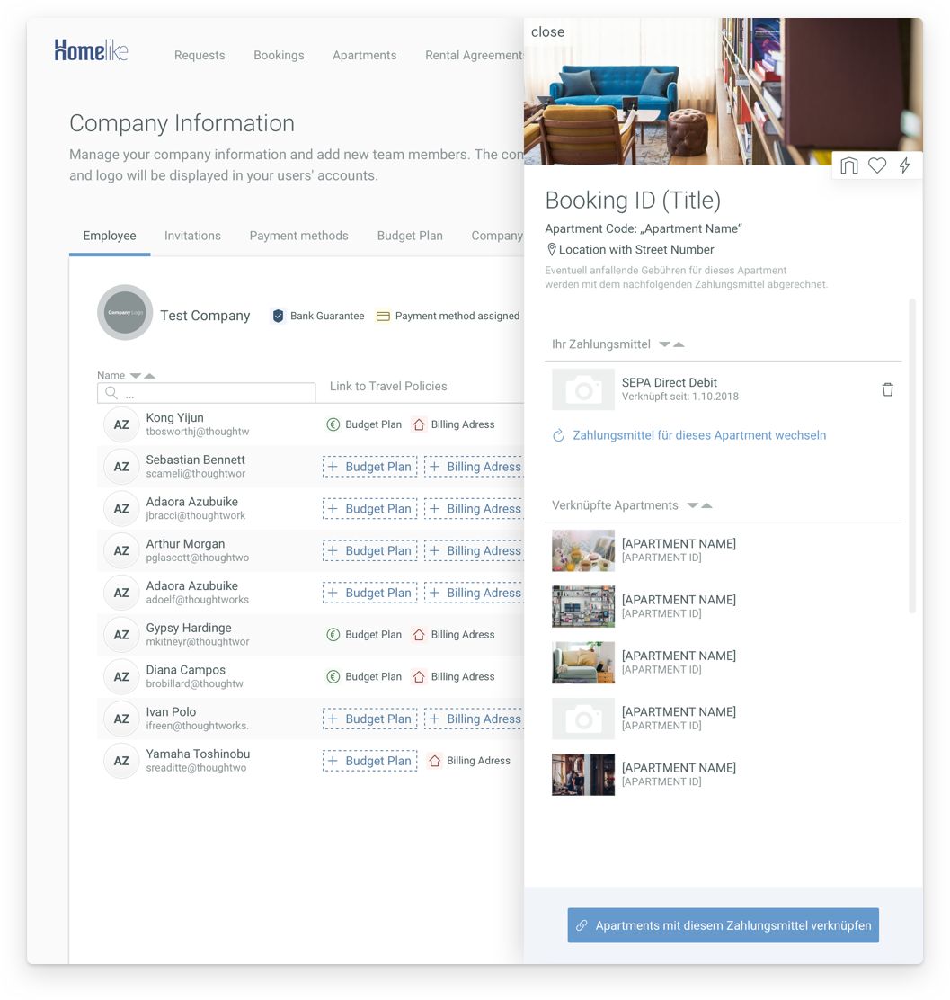

This was a tough one. The homelike application is a very powerful and feature-rich tool which gives the user the overview to manage all requests, bookings and other apartment related topics. Everything is reachable within a few clicks and fully functional on mobile screens. In order to support the user with his tasks, everything is designed to follow a guiding navigation structure.

### Dashboard – Before

In the old version there were several issues with the overview in the tables. If the users wanted to see more details in one booking, the tablecell opened itself vertically, pushing all other entries outside of the screenview. Furthermore, the horizontal alignment of the details made a mobile version of the Dashboard nearlly impossible. So a completly new design was made from scratch with mobile experience in mind.

I started with the global navigation on the left side. While the classical layout with the header on top, navigation on the left and content right offers easy and fast understanding of the application, the space for the content gets limited by the fixed width of the left navigation, especially on small desktops. We use a lot of tables with more than 5 columns, so we need as much space as possible horizontally. For this I placed the navigation on top of the whole page and made it scale horizontally. It is the first thing the user perceives when reading from top to bottom, so we support the hierachy of the page content by using a top-placed navigation.

Now to the tables, they are for the most part the main content of the whole application. I emphasise this by placing them on a white background, while the rest of the dashboard gets a light gray background to communicate the visual hierachy of the User Interface. 
Between the main navigation and white table there is a headline with a description to tell the user what can be achieved on the current page. In addition to that there is a small tab navigation, which serves as the second hierachy level for the content over the white background. 
I was very careful with the use of colors, because I wanted to guide the user trough the whole application to the main purpose of the current view, the Call-To-Action. There is always one very prominent button which in most cases is the most important task. You can see it here on the top right corner of the table.

Now to the tables, they are for the most part the main content of the whole application. I emphasise this by placing them on a white background, while the rest of the dashboard gets a light gray background to communicate the visual hierachy. 
But how do we solve the problem with the vertically expanding table cells, which push the content below out of the screen? How can I build a table on a mobile screen, where the width is limited and only vertical scrolling feels comfortable? 
Let’s beginn with the desktop table. The table consists of fully clickable rows, which will open to reveal more information. But now we open the details inside a new right sidebar, which is overlaying the content instead of pushing it away.

The sidebar is the exact same component we use on mobile screen. It has a fixed width and the content is vertically scrollable, which fits nicely in the desktop view and is perfect for scrolling on smartphones. 
Same size on desktop and mobile, same codebase, same experience.

When opening the sidebar the previous primary Call-To-Action is hidden behind the sidebar, it no longer refers to the main task of the previous tableview. Instead the sidebar is now in focus of the user and a new Call-To-Action is revealed in the bottom right. This top-left to bottom-right pattern is the guidance we use on all pages to support the user thoughout the dashboard.  

The last pattern we have to discuss is the table, but now on mobile screens. On desktop we have a lot of horizontal space, mobile screens are better in vertical spacing. I took the information we show inside one tablerow and reordered them in a new card component.

### Dashboard – Conclusion

TBD

