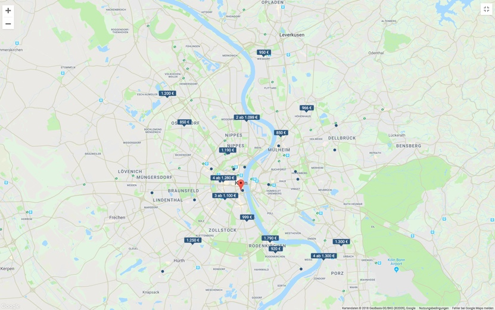
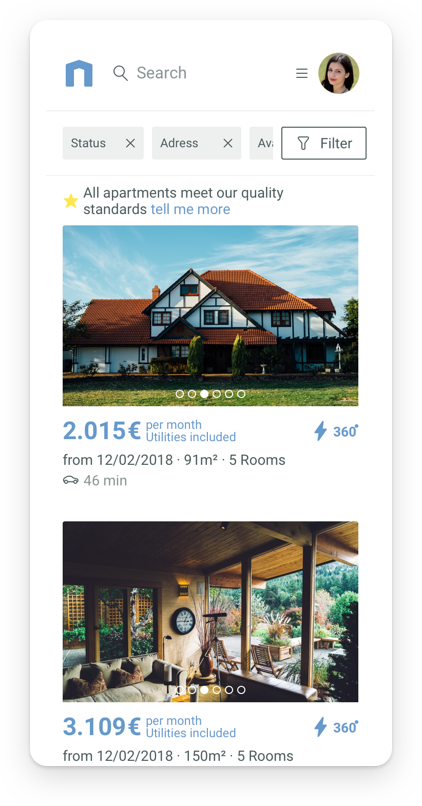

In the second of january 2018 I joined thehomelike.com as a Visual / Interface Designer. Homelike is a startup specializing in renting high quality apartments for business travellers.  One of the most important goals was to create a easy, clear but still powerful UI for mainly corporate users and landlords, which still use pen and paper methods for documenting apartments availabilities. 
The Redesign included the Apartment Search Page, the Apartment View Page and the complete Dashboard, which will be discussed in seperate sites. 
I will be talking about the problems I faced when reviewing the old design and present my solution, which will be explained in detail.

### Overview
The apartment photos are the most important tool to communicate Homelikes high quality apartment standards. They should be warm, comfy and welcoming to new customers. But the old design had a lot of visual noise which distracted from the otherwise good photos, so my main focus was to build a UI which gave the photos enough room to shine. 
Thinks like the prominent blue topbar or the usage of lots of borders and different background-shades contribute to the distraction. My goal here will be to design a page, which emphasises the photos as much as possible without losing funtionality.

### Apartment Cards
Starting with the Apartment Cards and the integrated photos itself, I tried to remove as much elements from the photo as possible and reordered them into the bottom of the card. This allows the photo to be fully visible without loosing focus on the price, which is now bigger and in Homelikes main color blue.

The cards itself contains now more information without looking bloated, which is important when repeated in a grid multiple times.

### Map Design
Another important eyecatcher was the map on the right side. Its appereance was a bit outdated with colors which were not defined in the Corporate Identity and hard-to-read labels. When the user spoted an interesting apartment on the left side, there was no way of telling where the corrosponing location is on the map. This lack of Interaction was solved by making all pricetags white, and only the actively hovered apartment gets a contrast-rich blue background. Other Points of interests like tramstation-labels and parks were designed in desatureted colors, so that they wouldn’t disctract too much from the photos.

### Mobile Screens
Homelikes Searchpage was originally build on a rather simple Bootstrap grid. The main focus of the old Design was to perform on Desktop Screens, the mobile experience suffered with pixelated, oversized photos and hard to tap Call-to-Actions.
 
I approached my redesign with the mobile-first attitude. Everything has to work on mobile first and all features are included in every screensize. No more feature-reduced mobile experiences, all Desktop features can be used on the go.
 
New features like the integrated gallery on the apartment card feel native on mobile browsers with swipe gestures, on Desktop a simple arrow-navigation allows to quickly browse photos with mouseclicks.

### Flexible Breakpoints
With our mobile-first approach, we definded a lot of screensizes which can be combined to create a new way to navigate the page. For example, when the clicks on a apartment, a new tab opens and shows the Apartment View Page.
We tried to iterate on this idea and allowed the user to see the Apartment in the same page by opening a sidebar, which has the exact same layout like the mobile version. We could boost our conversion even futher by just combining existing components in a clever way.

### Searchpage - Conclusion
When combining everything together the user is greeted with a cleaner, modern looking searchpage which focuses on the quality photos. The main layout keeps its roots in order to not confuse long-term users. It doesn’t matter if the user is on his smartphone or desktop, the search experience stays the same. After the release our customers were positivly surprised and raised the conversion rates by a significant margin.

