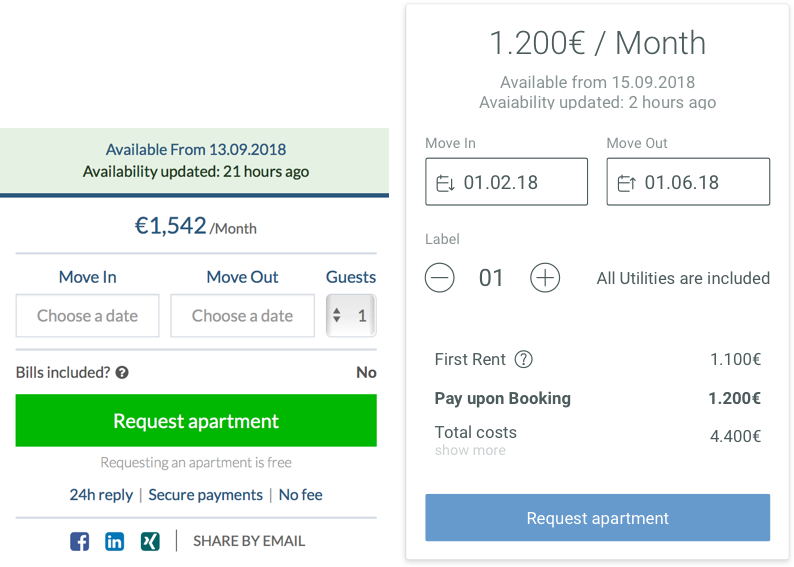
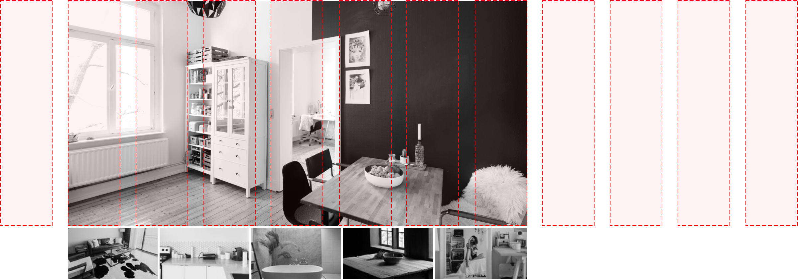
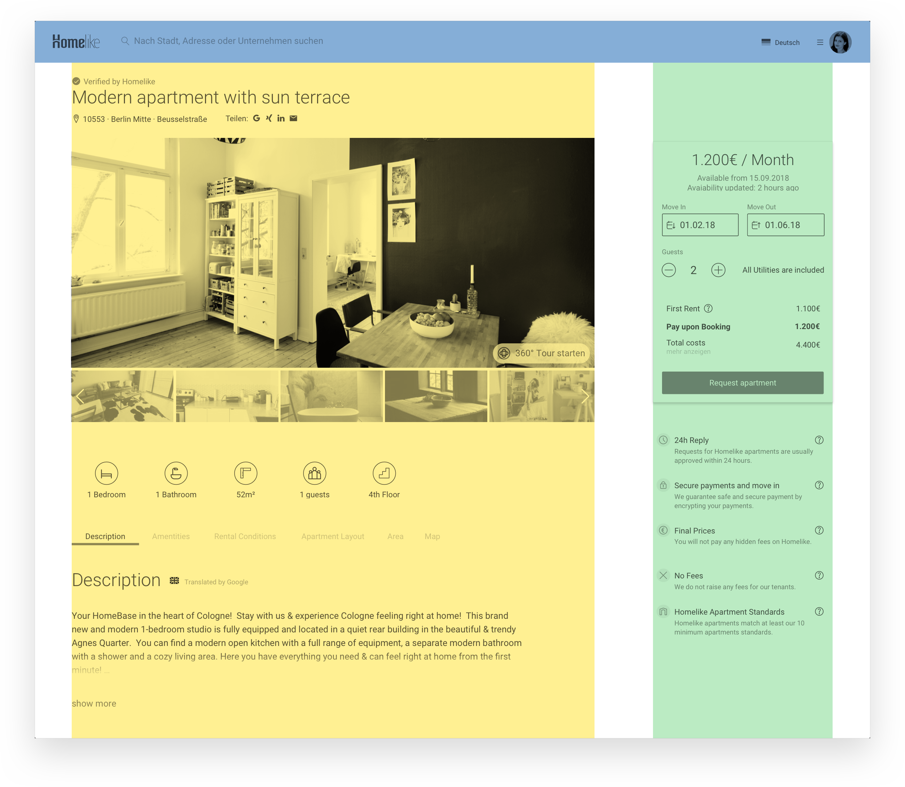
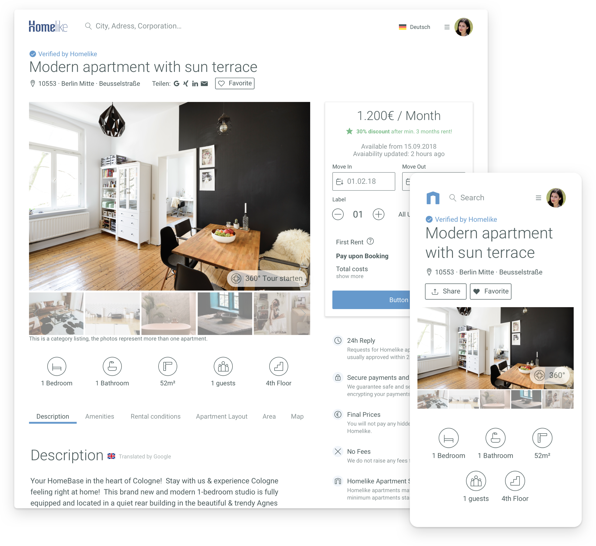

The View Page contains all relevant information about the apartment and tries to convince the user to book it. It should be easy and quick to scan, emphasize the most important information and keep secondary information less prominent.
Like on the searchpage, the photos are a good way to communicate the Homelike Quality Standards which every apartment must have.

### Overview

The old design suffered from the way it represented its main photo. Depending on the screensize, the photos in the header can be stretched up to 1920px width, which distorts the quality of the image and showed compression artifacts.  
Furthermore, the primary action of this page is to book the apartment. The design doesn’t support this business decision, because the old Call-to-Action button conflicts with dominant colors from other UI-Elements such as the Topbar. Shifting focus on the quality photos and the „Book Now“ will be the goal of the redesign.

### The Pricebox

The previous decision to let the pricebox be sticky and scroll with the content is a good idea, so I kept it this way. But the layout of the whole page has to support this behaivor by having enough space on the right side in order to let the box not interfere with underlying content. This plays well with the new idea to limit the picture-width, which will be discussed in a second.

In contrast to the old pricebox, the monthly rent is shown first and in bigger typo. Secondary information like the availability (which has a prominent background in the old version) is treated like secondary information should be treated, here in smaller sizes and beneath the primary one.

In order to focus on the main purpose of the box, elements like the share-function and trustelements were outsourced and placed in different locations.

### Apartment Pictures

Quality pictures of the apartment might be enough to convince the user to book his stay there. Therefore a pixelated or bad cropped presentation had to be avoided. For this I created a 12-column Grid for the whole page, in which the gallery has a fixed position in its witdh. This guarantees that the picture cannot be stretched above its native resolution and that even portrait shots from smartphones are displayed in its native aspect ratio (which we do not endorse).

Another problem with the old way of showing apartments was the fact that only the first picture was shown. There was no obvious way of knowing that there were more pictures wating to be seen. The gallery was hidden behind a secondary Call-to-Action, which according to some tests we observed nobody used. Most of the users clicked intuitively on the big picture in the header itself to open the gallery, so I adapted this behaivor on the main photo in the gallery. In addition to that I added a small thumbnail gallery beneath the main photo to show the next upcoming pictures.

### The Grid

Using a combination of a classical 12-column layout and a Soft Grid, which descripes the margins between different components, enables us to combine components in their different breakpoint states. For example, the pricebox on the right is nothing else than the mobile view, placed on the green gridlane to reserve space when the procebox scrolls. The yellow grid is the tablet view, on desktop just without the sticky pricebox on the bottom, which occurs only on mobile and tablet.

### Apartment View Page - Conclusion

The new design for the apartment search emphasizes the most important elements and functions for the user in order to convince him to book the apartment. It easy to spot the primary Call-To-Action „Book now“, all apartment photos are in a high quality with an optimal resolution and aspect ratio. We show additional photos in a thumbnail gallery, and everything is present on mobile screens without cutting features out.

