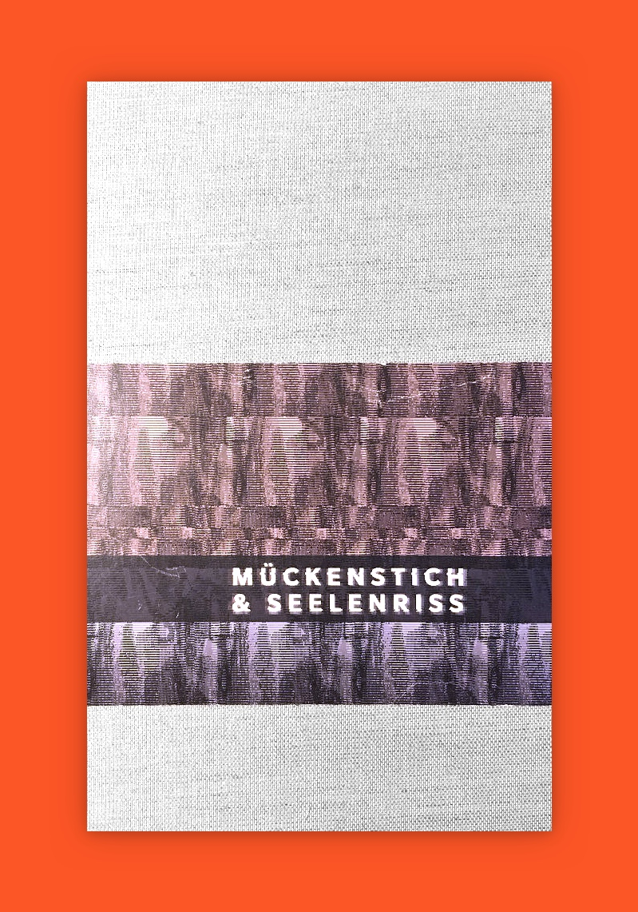
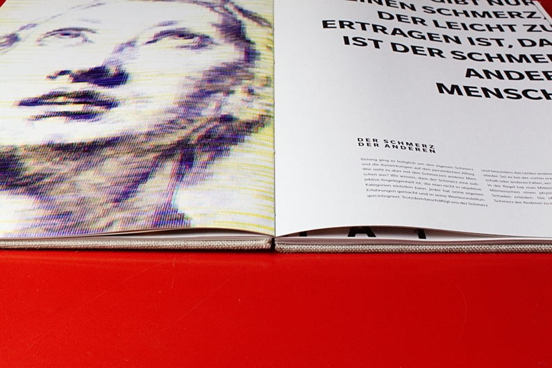
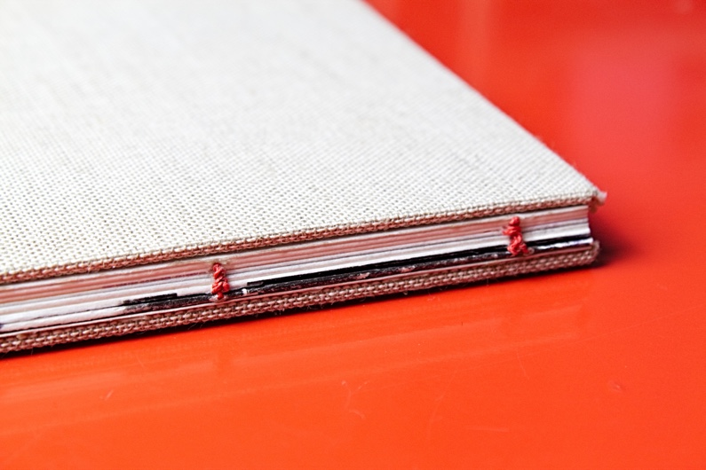
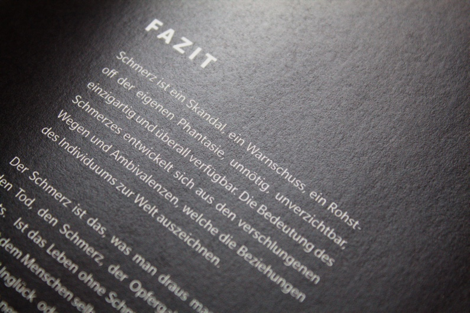

In my bachelor thesis I challenged myself to create a book dedicated to pain. Pain is the most basic form of communication in our nervous system, which is able to save and destroy our lives. The visual representation of pain in this book is communicated through so called Glitch Art. In order to achieve this effect you open a picture in a text editor, manipulate the code by deleting and reordering random lines of code and save it again. The analogy in real life is the pain, which is able to brutally create chaos in our existence. It can distort our behaivor, shift our focus and make us suffer, but the outcome of it may have positive learnings for each and everyone.

